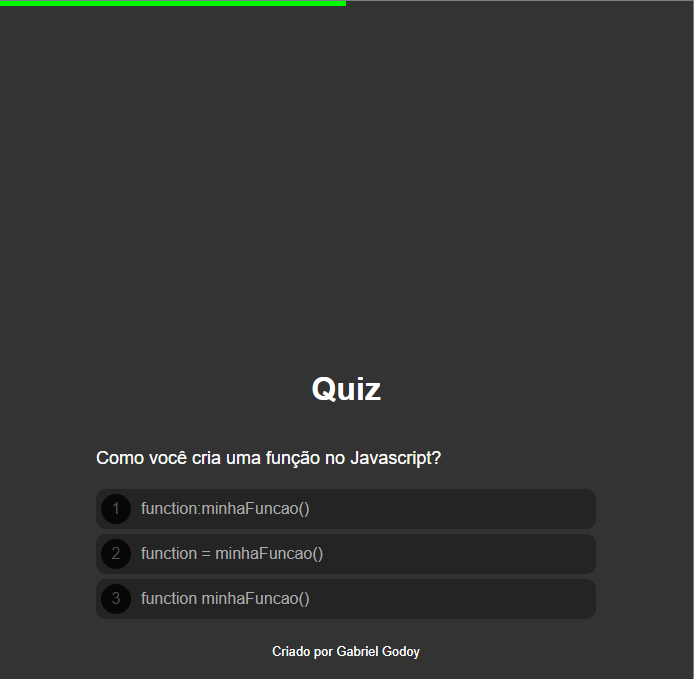
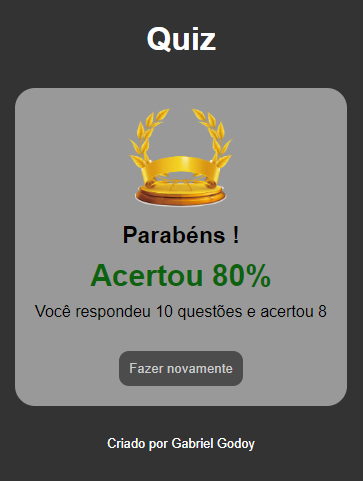
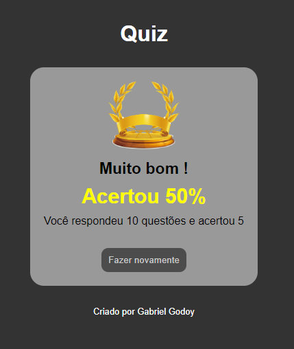
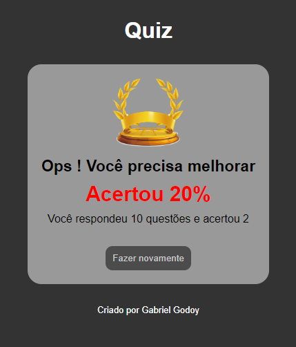

<h1 align="center"> PROJETO QUIZ </h1>

O quiz é baseado em perguntas básicas de front-end, como por exemplo, javascript  

  <a href="#-tecnologias">Tecnologias</a>&nbsp;&nbsp;&nbsp;|&nbsp;&nbsp;&nbsp;
  <a href="#-projeto">Projeto</a>&nbsp;&nbsp;&nbsp;|&nbsp;&nbsp;&nbsp;
  <a href="#-layout">Links</a>&nbsp;&nbsp;&nbsp;|&nbsp;&nbsp;&nbsp;
  <a href="#-layout">Layout</a>&nbsp;&nbsp;&nbsp;&nbsp;&nbsp;&nbsp;

  

 

## 🚀 Tecnologias

Esse projeto foi desenvolvido com as seguintes tecnologias:

- HTML
- CSS
- JavaScript

## 💻 Projeto

O projeto tem como objetivo treinar fundamentos de front-end. Nesse caso, foi praticada a manipulação do DOM utilizando javascript, HTML e CSS. Portanto, podemos perceber esses princípios nas imagens abaixo:  
- Barra de progresso:

 

- Regra para percentual de acertos:

  
  
  

## Links

- Instalação do [VSCode](https://code.visualstudio.com/Docs)
- Documentação do [CSS](https://developer.mozilla.org/pt-BR/docs/Web/CSS)
- Documentação do [HTML](https://developer.mozilla.org/pt-BR/docs/Web/HTML)
- Documentação do [JS](https://developer.mozilla.org/pt-BR/docs/Web/JavaScript)

## 🔖 Layout

Você pode visualizar o funcionamento do projeto através [desse link](https://godoybiel97.github.io/projeto-quiz-frontend/).
